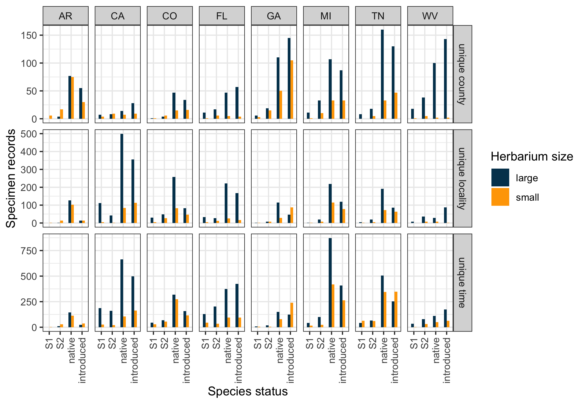
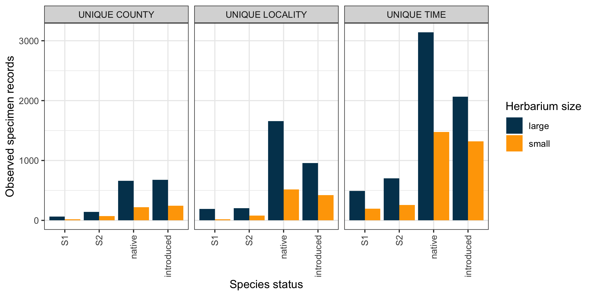
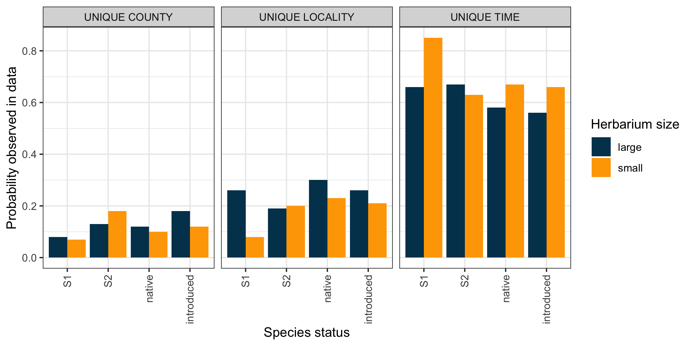
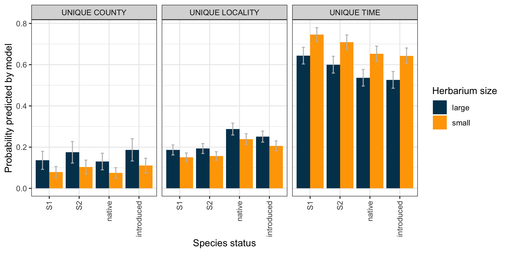
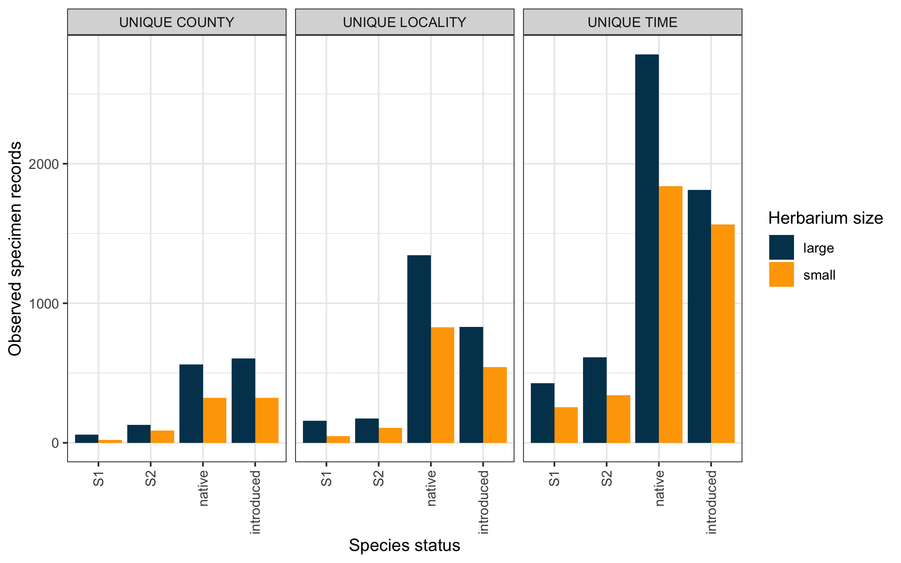
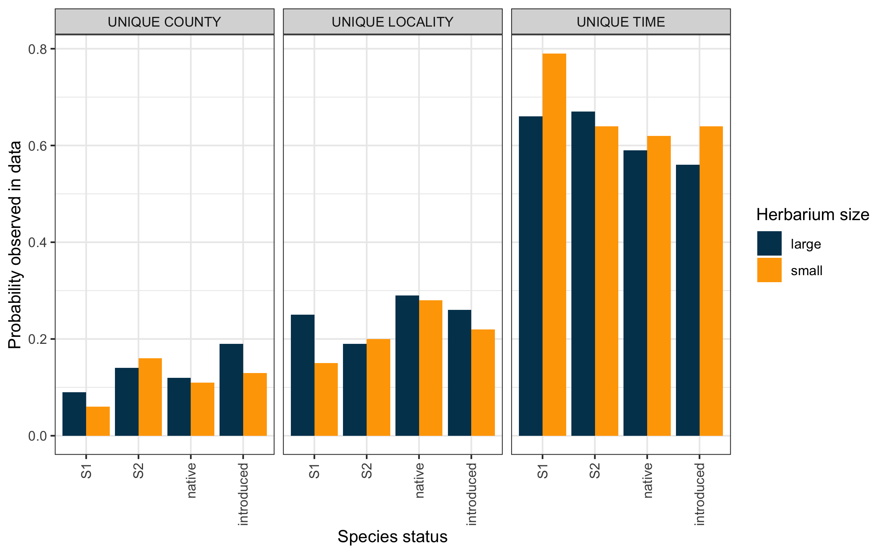
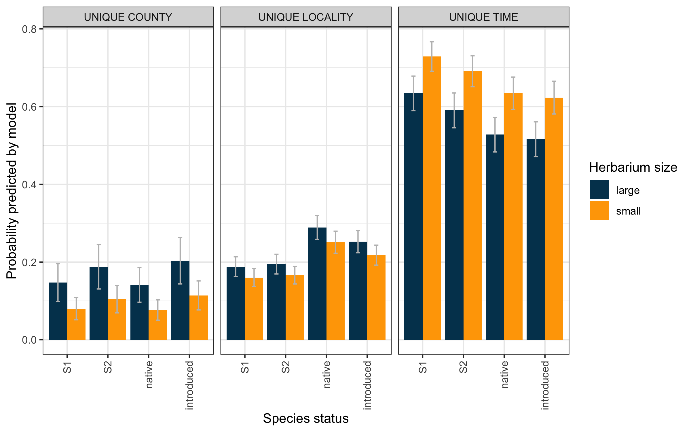

This document contains code written by Erica Krimmel and Diana Soteropoulos to support data analysis of the NANSH research project (2013-2020). If you want to reuse this code, you should open this file in R and begin by loading packages, setting options, and declaring input data filenames. If you haven't already installed the packages called, you will also need to do that.

```{r message = FALSE, warning = FALSE}
# Load general packages
library(tidyverse)

# Load packages for working with geospatial data
library(rgeos)
library(rgdal)
library(maptools)

# Load packages for working with model data
library(car)
library(lme4)
library(lsr)
library(emmeans)

# Load packages for formatting in RMarkdown
library(kableExtra)

# Tell R not to use scientific notation
options(scipen = 999)

# The following variables should correlate to input data files in your working
# directory. Edit the filenames here if necessary:
input_specimens <- "Marsico-et-al-2020_specimens_2019-04-17.csv"
input_herbaria <- "Marsico-et-al-2020_herbaria_2019-06-08.csv"
input_species <- "Marsico-et-al-2020_species_2020-07-09.csv"
```

### Prepare data

This first function prepares an analysis dataset by combining raw data from three compiled data tables (specimens, herbaria, species), filtering out low-quality records, and retaining a single representative record in the case of duplicate specimens. The function also assigns a "uniqueness flag" to each record based on whether its collecting event represents a unique county, unique locality, or unique time. You can use this function to generate different versions of the dataset based on what states you want to include, whether or not you want to include out-of-state herbaria (where we have that information), and what numerical break you want to use to define "small" vs. "large" herbaria (our default is 100,000 specimens).

```{r message = FALSE, warning = FALSE}
# Set function and argument defaults
prepare_analysisSpms <- function(input_specimens, input_herbaria, input_species, 
                                     sizeCutoff = 100000,
                                     filterState = "all",
                                     includeOutOfState = FALSE) {
  
  # Record factor variables to use for naming future global variables and files
  recordedVariables <- paste(sizeCutoff, "_",
                    filterState, "_", 
                    includeOutOfState,
                    sep = "")
  filename_unique <- paste("output/Marsico-et-al-2020_uniqueSpms_", 
                    recordedVariables, "_",
                    Sys.Date(), 
                    ".csv", 
                    sep = "")
  filename_analysis <- paste("output/Marsico-et-al-2020_analysisSpms_", 
                    recordedVariables, "_",
                    Sys.Date(), 
                    ".csv", 
                    sep = "")
  filename_summary <- paste("output/Marsico-et-al-2020_analysisSummary_", 
                    recordedVariables, "_",
                    Sys.Date(), 
                    ".csv", 
                    sep = "")
  
  # Read in collated raw data
  input_specimensTbl <- read_csv(input_specimens, na = character())
  input_herbariaTbl <- read_csv(input_herbaria, na = character())
  input_speciesTbl <- read_csv(input_species, na = character())
  
  # Create a new column to assign sizeClass values to herbaria based on the
  # sizeCutoff input variable
  input_herbariaTbl <- input_herbariaTbl %>% 
    mutate(sizeClass = case_when(sizeNumber >= sizeCutoff ~ "large",
                                 sizeNumber < sizeCutoff ~ "small"))
  
  # Calculate the percentage of specimens held by large and small herbaria
  # within the institutions included in `input_herbariaTbl`
  totalSpmsSummary <- input_herbariaTbl %>% 
    group_by(sizeClass) %>% 
    summarize(totalSpecimens = sum(sizeNumber)) %>% 
    mutate(percentSpecimens = round(100*totalSpecimens/sum(totalSpecimens, 2)))
  
  # Rename `totalSpmsSummary` to include `recordedVariables` from function input
  assign(paste("totalSpmsSummary_", recordedVariables, sep = ""),
         totalSpmsSummary, envir = globalenv())
  
  # Assign variable dataFlag to tell the intermediary dataset `joinedSpms`
  # whether or not to include out of state herbaria
  if(includeOutOfState == FALSE) {
    dataFlag = "COUNTY-reassigned"
  } else if(includeOutOfState == TRUE) {
    dataFlag = c("COUNTY-reassigned", "HERBARIA-out-of-state",
                 "HERBARIA-out-of-state; COUNTY-reassigned")  
  } else {
    print("ERROR: Please assign a TRUE/FALSE value to the includeOutOfState
          variable in this function.")
  }
  
  # If the filterState variable is set to "all" update it based on actual state 
  # values in the dataset 
  if(filterState == "all"){
    filterState = levels(factor(input_herbariaTbl$state))
  } else {
    filterState = filterState
  }
  
  # Build dataset `joinedSpms`...
  joinedSpms <- input_specimensTbl %>%
    filter(state %in% filterState) %>% 
    
    # Join relevant columns from `input_speciesTbl` and `input_herbariaTbl`
    left_join(select(input_speciesTbl, index, status), 
              by = c("species_index"="index")) %>%
    left_join(select(input_herbariaTbl, index, herbName, sizeClass), 
              by = c("herbaria_index"="index")) %>% 
    
    # Create columns for countyState and dateRange
    unite(countyState, c(county, state), sep = "_", remove = FALSE) %>% 
    unite(dateRange, c(earlyDate, lateDate), sep = " to ", remove = FALSE) %>% 
    
    # Remove rows that have already been marked as low quality by filtering out
    # those with data flags other than those allowed by the variable dataFlag
    filter(DATA_FLAG == "" | DATA_FLAG %in% dataFlag) %>% 
    
    # Group duplicate specimens and create a temporary column groupIndex
    unite(duplicateGroup, 
          c(species_index, countyState, dateRange, collectorStandard), 
          sep = "|", remove = FALSE) %>% 
    mutate(groupIndex = group_indices(.,duplicateGroup)) %>% 
    select(-duplicateGroup)
  
  # Build dataset `duplicateSpms` to record size classes of the herbaria holding
  # each set of duplicates
  duplicateSpms <- joinedSpms %>% 
    group_by(groupIndex) %>%
    arrange(desc(sizeClass)) %>% 
    summarise(duplicateStatus = paste(sizeClass, collapse = ","))
  
  # Add results from `duplicateSpms` back into full dataset and deal with
  # duplicate rows: if duplicates within a set are shared between large and
  # small collections then discard all rows, if duplicates within a set are held
  # by only small or only large herbaria then retain one representative from the
  # set and discard the remaining duplicate rows.
  uniqueSpms <- joinedSpms %>% 
    left_join(duplicateSpms, by = "groupIndex") %>% 
    group_by(groupIndex) %>% 
    # Make sure to retain a row with coordinate data, if possible
    arrange(latitude) %>% 
    filter(row_number()==1)
  
  # Rename `uniqueSpms` to include `recordedVariables` from function input
  assign(paste("uniqueSpms_", recordedVariables, sep = ""),
         uniqueSpms, envir = globalenv())
  
  # Output result to CSV file
  write_csv(uniqueSpms, filename_unique)
  
  # Report on how large and small collections share duplicate specimens
  duplicateSpmsSummary <- uniqueSpms %>% 
    mutate(duplicateType = case_when(duplicateStatus == "large" ~ 
                              "unduplicated",
                            duplicateStatus == "small" ~ 
                              "unduplicated",  
                            str_detect(duplicateStatus, "small,large") ~
                              "duplicated by large and small herbaria",
                            !str_detect(duplicateStatus, "large") ~
                              "duplicated only by small herbaria",
                            !str_detect(duplicateStatus, "small") ~
                              "duplicated only by large herbaria")) %>% 
    group_by(sizeClass, duplicateType) %>% 
    tally() %>% 
    pivot_wider(names_from = sizeClass, values_from = n) %>% 
    rename(largeCount = large, smallCount = small) %>% 
    mutate(largePercent = round(largeCount/sum(largeCount, na.rm = TRUE)*100, 2)) %>% 
    mutate(smallPercent = round(smallCount/sum(smallCount, na.rm = TRUE)*100, 2))
  
  # Rename `duplicateSpmsSummary` to include `recordedVariables` from function
  # input
  assign(paste("duplicateSpmsSummary_", recordedVariables, sep = ""),
         duplicateSpmsSummary, envir = globalenv())
  
  # Determine what the expected proportion of specimens held by large vs. small
  # herbaria is
  expectedProportion <- uniqueSpms %>% 
    group_by(sizeClass) %>% 
    tally() %>% 
    mutate(freq = n/sum(n)) %>% 
    pull(freq)
  
  # Pull out expected proportion of just small herbaria
  expectedProportionSmall <- expectedProportion[2]
  
  # Rename `expectedProportionSmall` to include `recordedVariables` from function
  # input
  assign(paste("expectedProportion_", recordedVariables, sep = ""),
         expectedProportion, envir = globalenv())
  
  # Remove rows without coordinates from uniqueSpms to begin the process of
  # evaluating which specimens were collected within 1km of each other (i.e. at
  # non-unique localties)
  geo_uniqueSpms <- uniqueSpms %>% filter(!is.na(longitude))
  
  # Create spatial data frame to use in geographic analysis below
  geo_spdf <- SpatialPointsDataFrame(coords = cbind(geo_uniqueSpms$longitude,
                                                    geo_uniqueSpms$latitude),
                                     data = geo_uniqueSpms, 
                                     proj4string = 
                                       CRS("+proj=longlat +datum=WGS84"))
  
  # Project data in Conus Albers (NAD83) so that we can calculate 1km buffers
  geo_project <- spTransform(geo_spdf, CRS("+init=epsg:5070"))
  
  # Create new spatial data frame with 1km polygons buffering each point
  geo_buffer <- gBuffer(geo_project, byid=TRUE, width=1000)
  
  # Join attributes by location to determine which buffers intersect each other,
  # then return a count of how many points lie within any given 1km buffer
  geo_intersect <- over(geo_buffer, geo_buffer[, "index"], returnList = TRUE)
  geo_count <- sapply(geo_intersect, nrow)
  geo_bound <- spCbind(geo_project, geo_count)
  geo_data <- geo_bound@data %>% 
    mutate(nearbySpms = geo_count - 1) %>% 
    select(-geo_count)
  
  # Add geospatial analysis results `geo_data` back into full `uniqueSpms` data
  analysisSpms <- uniqueSpms %>% 
    left_join(select(geo_data, index, nearbySpms), by = "index") 
  
  # Flag unique counties
  groupCounty <- uniqueSpms %>%
    group_by(species_index, countyState) %>% tally() %>%
    mutate(unique_county = case_when(n == 1 ~ "unique_county")) %>%
    ungroup()
  
  # Flag unique localities and unique times
  analysisSpms <- analysisSpms %>%
    filter(!str_detect(duplicateStatus, "small,large" )) %>%
    left_join(groupCounty, by = c("species_index", "countyState")) %>% 
    mutate(unique_locality = case_when(nearbySpms == 0 ~ "unique_locality")) %>%
    unite("uniqueness", c("unique_county", "unique_locality"), sep = "/") %>%
    mutate(uniqueness = sub("unique_county/unique_locality", "unique_county", 
                            uniqueness)) %>%
    mutate(uniqueness = sub("unique_county/NA", "unique_county", 
                            uniqueness)) %>%
    mutate(uniqueness = sub("NA/unique_locality", "unique_locality",
                            uniqueness)) %>%
    mutate(uniqueness = sub("NA/NA", "unique_time", 
                            uniqueness)) %>% 
    unite("check", c("uniqueness", "dateRange"), sep = "/", remove = FALSE) %>% 
    filter(check != "unique_time/\"1800\" to \"2015\"") %>% 
    select(-n, -check) %>% 
    ungroup
  
  # Rename `analysisSpms` to include `recordedVariables` from function input
  assign(paste("analysisSpms_", recordedVariables, sep = ""),
         analysisSpms, envir = globalenv())
    
  # Output result to CSV file
  write_csv(analysisSpms, filename_analysis)
  
  # Group `analysisSpms` data for use in figures
  analysisSummary <- analysisSpms %>% 
    group_by(uniqueness, state, status, sizeClass) %>% 
    tally() %>% 
    group_by(uniqueness, state, status) %>% 
    mutate(frequency = round((n/sum(n)),2)) %>% 
    rename(count = n)

  # Rename `analysisSummary` to include `recordedVariables` from function input
  assign(paste("analysisSummary_", recordedVariables, sep = ""),
         analysisSummary, envir = globalenv())
    
  # Output result to CSV file; note that rows may be missing where no unique
  # specimens were found and that this is resolved in the code below for
  # purposes of graphing results
  write_csv(analysisSummary, filename_summary)
}
```
```{r message = FALSE, warning = FALSE}
# Run function
prepare_analysisSpms(input_specimens, input_herbaria, input_species)
```

We get several resulting objects by running the function above with our default values (i.e. a size cutoff of 100000 specimens to differentiate between small and large herbaria, and including data from all states but no out-of-state herbaria). The following objects now exist in our R environment...

`totalSpmsSummary_100000_all_FALSE` is a summary of how many total specimens are held by the herbaria participating in this project:

```{r echo = FALSE, results = 'asis'}
knitr::kable(totalSpmsSummary_100000_all_FALSE) %>%
  kable_styling(bootstrap_options = 
                         c("striped", "hover", "condensed"),
                full_width = FALSE)
```

`duplicateSpmsSummary_100000_all_FALSE` is a summary of how many specimens in the uniqueSpms dataset represent duplicates in the original data (i.e. the input_specimens):

```{r echo = FALSE, results = 'asis'}
knitr::kable(duplicateSpmsSummary_100000_all_FALSE) %>% 
  kable_styling(bootstrap_options = 
                         c("striped", "hover", "condensed"),
                full_width = FALSE)
```
```{r message = FALSE, warning = FALSE}
# Manually add rows that do not exist on `analysisSummary_100000_all_FALSE`
# because there was no data; this will let us effectively use this for graphing
analysisSummary_100000_all_FALSE <- analysisSummary_100000_all_FALSE %>% 
  ungroup %>% 
  add_row(uniqueness="unique_county",
          state="AR",
          status="S1",
          sizeClass="large",
          count=0,
          frequency=0) %>% 
  add_row(uniqueness="unique_county",
          state="TN",
          status="S1",
          sizeClass="small",
          count=0,
          frequency=0) %>% 
  add_row(uniqueness="unique_locality",
          state="AR",
          status="S1",
          sizeClass="large",
          count=0,
          frequency=0) %>% 
  add_row(uniqueness="unique_locality",
          state="WV",
          status="S1",
          sizeClass="small",
          count=0,
          frequency=0) %>% 
  add_row(uniqueness="unique_time",
          state="AR",
          status="S1",
          sizeClass="large",
          count=0,
          frequency=0) %>% 
  arrange(uniqueness, state, status, sizeClass) %>% 
  mutate(uniqueness = str_replace(uniqueness, "_", " "))

# Add factors for ordering of `analysisSummary_100000_all_FALSE` 
# categories in graph below
analysisSummary_100000_all_FALSE$status2 <- factor(
  analysisSummary_100000_all_FALSE$status, 
  levels = c("S1", "S2", "native", "introduced"))
  
# Graph unique specimen records in each of our four categories by species
# status and herbarium size class
analysisSummary_100000_all_FALSE %>% 
  ggplot(aes(x = status2, y = count, label = count)) +
  geom_bar(aes(fill = sizeClass),
           stat="identity", width = 0.5, position = "dodge") +
  scale_fill_manual(values=c("#003f5c", "#ffa600")) +
  scale_y_continuous() +
  facet_grid(uniqueness ~ state, scales = "free_y") +
  theme_bw() +
  theme(axis.text.x = element_text(angle = 90, hjust = 1, vjust = 0.5)) +
  labs(color = "Size class",
       fill = "Herbarium size",
       x = "Species status",
       y = "Specimen records")
  
# Save graph to file
ggsave(paste("output/Marsico-et-al-2020_summaryFigure_100000_all_FALSE_", 
             Sys.Date(), 
             ".png", 
             sep = ""),
       width = 7.25,
       height = 5)
```

`analysisSummary_100000_all_FALSE` is a summarized version of the analysisSpms data to use for analysis and graphing:

```{r echo = FALSE, results = 'asis'}
knitr::kable(analysisSummary_100000_all_FALSE) %>% 
    kable_styling(bootstrap_options = 
                         c("striped", "hover", "condensed")) %>% 
  scroll_box(height = "200px")
```

We also have `uniqueSpms_100000_all_FALSE`, which is a comprehensive dataset of the unique specimen records included in this project, and `analysisSpms_100000_all_FALSE`, which is the primary dataset generated by this function to be used in the rest of the project's analysis. This function writes a CSV version of the `uniqueSpms`, `analysisSpms`, and `analysisSummary` objects to the output folder in your working directory. It also generates and saves a figure for the `analysisSummary` data, as shown here:



We can use the `analysisSpms` data to visualize different facets of the project, e.g. this figure illustrating how many specimens were contributed by large versus small herbaria in each state.

```{r echo = FALSE}
# Group analysis data for graphing
statesFigureData_100000_all_FALSE <- analysisSpms_100000_all_FALSE %>% 
  group_by(state, sizeClass) %>% 
  tally() %>% 
  ungroup() %>% 
  group_by(state) %>% 
  mutate(percent = scales::percent(n/sum(n), accuracy = .1))

# Set factor to order states by size for readability
statesFigureData_100000_all_FALSE$state2 <- factor(
  statesFigureData_100000_all_FALSE$state, levels = 
    c("CA","MI","TN","FL","CO","GA","WV","AR"))

# Create graph of specimens contributed by state and by size class
statesFigureData_100000_all_FALSE %>% 
  ggplot(aes(x = state2, y = n, label = percent)) +
  geom_bar(aes(fill = sizeClass), stat="identity", width = 0.5) +
  scale_fill_manual(values=c("#003f5c", "#ffa600")) +
  geom_label(aes(group = sizeClass),
            position = position_stack(vjust = .5), size = 3) +
  labs(color = "Size class",
       fill = "Herbarium size",
       x = "State",
       y = "Specimen records") +
  theme_bw()

# Save graph to PNG file
ggsave(paste("output/Marsico-et-al-2020_statesFigure_100000_all_FALSE_", 
             Sys.Date(), 
             ".png", 
             sep = ""),
       width = 8,
       height = 5)
```

### Model data

In modeling the data, we wanted to ask what factors predict uniqueness of a specimen at a given uniqueness category scale (county, locality, or time). We are analyzing the data using *multiple logistic regression* because we have a nominal response variable ("Is the specimen unique? Yes/No") as well as nominal predictor variables: **size class** (small, large), **species status** (S1, S2, native, introduced), and **state** (AR, CA, CO, FL, GA, MI, TN, WV). To model this, we are using a *generalized linear mixed-effects model (GLMM)*, with state as a random variable.

```{r}
# Set dummy coding function to transform analysis dataset by splitting up our
# response variable (uniqueness) into three levels so we can analyze them
# individually: unique_county, unique_locality, unique_time
model_analysisSpms <- function(analysisSpms) {
  
  # Extract input variables to use for naming future global variables and files
  recordedVariables <- deparse(substitute(analysisSpms)) %>% 
    str_remove("analysisSpms_")
  filename_results <- paste("output/Marsico-et-al-2020_modelResults_", 
                    recordedVariables, "_",
                    Sys.Date(), 
                    ".csv", 
                    sep = "")
  
  # Set generic function to convert a level of a column into a new binary column
  convert_toLogicals <- function(data, column, value) {
    data %>% mutate(!!value := as.numeric(case_when(str_detect(column, value)==
                                                      TRUE ~ "1", 
                                                    str_detect(column, value)==
                                                      FALSE ~ "0")))
  }
  
  # Get levels from the response variable column
  levels_uniqueness <- levels(factor(analysisSpms$uniqueness))
  
  # Use the `convert_toLogicals` function to generate new binary columns based
  # on the nominal values of the response column
  analysisSpms_binary <- analysisSpms %>% 
    select(index, uniqueness, sizeClass, status, state)
  
  for (i in seq_along(levels_uniqueness)) {
    analysisSpms_binary <- analysisSpms_binary %>% 
      convert_toLogicals(.$uniqueness, levels_uniqueness[i])
  }

  # Return this new binary version of the dataset as our model data
  modelData <- analysisSpms_binary %>% 
    select(index,
           unique_county,
           unique_locality,
           unique_time,
           everything(),
           -uniqueness)
  
  # Save `modelData` in the global environment
  assign(paste("modelData_", recordedVariables, sep = ""),
         modelData, envir = globalenv())
  
  # Include state as a random variable for all states, but not for
  # specific states
  if(grepl("all", recordedVariables)) {
    
    #Generate models for county-level uniqueness
    county_m1 <- glmer(data = modelData,
                       unique_county ~ sizeClass + (1|state),
                       family = binomial(link="logit"))
    county_m2 <- glmer(data = modelData,
                       unique_county ~ status + (1|state), 
                       family = binomial(link="logit"))
    county_mGLOBAL <- glmer(data = modelData,
                            unique_county ~ sizeClass + status+ (1|state), 
                            family = binomial(link="logit"))
    county_mNULL <- glmer(data = modelData,
                          unique_county ~ 1 + (1|state), 
                          family = binomial(link="logit"))
    
    # Generate models for locality-level uniqueness
    locality_m1 <- glmer(data = modelData,
                         unique_locality ~ sizeClass + (1|state),
                         family = binomial(link="logit"))
    locality_m2 <- glmer(data = modelData,
                         unique_locality ~ status + (1|state), 
                         family = binomial(link="logit"))
    locality_mGLOBAL <- glmer(data = modelData,
                              unique_locality ~ sizeClass + status + (1|state), 
                              family = binomial(link="logit"))
    locality_mNULL <- glmer(data = modelData,
                            unique_locality ~ 1 + (1|state), 
                            family = binomial(link="logit"))
    
    # Generate models for time-level uniqueness
    time_m1 <- glmer(data = modelData,
                     unique_time ~ sizeClass + (1|state),
                     family = binomial(link="logit"))
    time_m2 <- glmer(data = modelData,
                     unique_time ~ status + (1|state), 
                     family = binomial(link="logit"))
    time_mGLOBAL <- glmer(data = modelData,
                          unique_time ~ sizeClass + status + (1|state), 
                          family = binomial(link="logit"))
    time_mNULL <- glmer(data = modelData,
                        unique_time ~ 1 + (1|state), 
                        family = binomial(link="logit"))
  } else if(!grepl("all", recordedVariables)) {
     
    # Generate models for county-level uniqueness
    county_m1 <- glmer(data = modelData,
                       unique_county ~ sizeClass,
                       family = binomial(link="logit"))
    county_m2 <- glmer(data = modelData,
                       unique_county ~ status, 
                       family = binomial(link="logit"))
    county_mGLOBAL <- glmer(data = modelData,
                            unique_county ~ sizeClass + status, 
                            family = binomial(link="logit"))
    county_mNULL <- glmer(data = modelData,
                          unique_county ~ 1, 
                          family = binomial(link="logit"))
    
    # Generate models for locality-level uniqueness
    locality_m1 <- glmer(data = modelData,
                         unique_locality ~ sizeClass,
                         family = binomial(link="logit"))
    locality_m2 <- glmer(data = modelData,
                         unique_locality ~ status, 
                         family = binomial(link="logit"))
    locality_mGLOBAL <- glmer(data = modelData,
                              unique_locality ~ sizeClass + status, 
                              family = binomial(link="logit"))
    locality_mNULL <- glmer(data = modelData,
                            unique_locality ~ 1, 
                            family = binomial(link="logit"))
    
    # Generate models for time-level uniqueness
    time_m1 <- glmer(data = modelData,
                     unique_time ~ sizeClass,
                     family = binomial(link="logit"))
    time_m2 <- glmer(data = modelData,
                     unique_time ~ status, 
                     family = binomial(link="logit"))
    time_mGLOBAL <- glmer(data = modelData,
                          unique_time ~ sizeClass + status, 
                          family = binomial(link="logit"))
    time_mNULL <- glmer(data = modelData,
                        unique_time ~ 1, 
                        family = binomial(link="logit"))
  } else {
    print("ERROR: There is a problem with the state/s being passed into this
          function via the analysisSpms dataframe name.")
  }
  
  # Pull results out of model objects so that we can compare more easily
  modelResults <- tribble(
    ~responseVariable, ~modelName, ~modelFormula, ~AIC,
    "unique_county", "m1", deparse(formula(county_m1)), AIC(county_m1),
    "unique_county", "m2", deparse(formula(county_m2)), AIC(county_m2),
    "unique_county", "mGLOBAL", deparse(formula(county_mGLOBAL)), AIC(county_mGLOBAL),
    "unique_county", "mNULL", deparse(formula(county_mNULL)), AIC(county_mNULL),
    "unique_locality", "m1", deparse(formula(locality_m1)), AIC(locality_m1),
    "unique_locality", "m2", deparse(formula(locality_m2)), AIC(locality_m2),
    "unique_locality", "mGLOBAL", deparse(formula(locality_mGLOBAL)), AIC(locality_mGLOBAL),
    "unique_locality", "mNULL", deparse(formula(locality_mNULL)),AIC(locality_mNULL),
    "unique_time", "m1", deparse(formula(time_m1)), AIC(time_m1),
    "unique_time", "m2", deparse(formula(time_m2)),AIC(time_m2),
    "unique_time", "mGLOBAL", deparse(formula(time_mGLOBAL)), AIC(time_mGLOBAL),
    "unique_time", "mNULL", deparse(formula(time_mNULL)), AIC(time_mNULL))
  
  # Rename global models for each uniqueness level to include
  # `recordedVariables` from function input and save to global environment
  # for testing fit
  assign(paste("county_mGLOBAL_", recordedVariables, sep = ""),
         county_mGLOBAL, envir = globalenv())
  assign(paste("locality_mGLOBAL_", recordedVariables, sep = ""),
         locality_mGLOBAL, envir = globalenv())
  assign(paste("time_mGLOBAL_", recordedVariables, sep = ""),
         time_mGLOBAL, envir = globalenv())
  
  # Calculate delta AIC and AIC weights for each uniqueness level 
  modelResults <- modelResults %>% 
    group_by(responseVariable) %>% 
    mutate(dAIC = round(AIC - min(AIC), 1)) %>% 
    mutate(AIC = round(AIC, 0)) %>% 
    mutate(weight = round(exp(- 0.5 * dAIC)/sum(exp(- 0.5 * dAIC)), 2))
  
  # Rename `modelResults` to include `recordedVariables` from function input
  assign(paste("modelResults_", recordedVariables, sep = ""),
         modelResults, envir = globalenv())
  
  # Output result to CSV file
  write_csv(modelResults, filename_results)
}
```
```{r message = FALSE, warning = FALSE}
# Run function for default analysis variables
model_analysisSpms(analysisSpms_100000_all_FALSE)
```

Our new reformatted `modelData` looks like this:

```{r echo = FALSE, results = 'asis'}
knitr::kable(head(modelData_100000_all_FALSE)) %>% 
  kable_styling(bootstrap_options = 
                         c("striped", "hover", "condensed"))
```

We will use `modelData` to generate our generalized linear mixed-effects models using the `lme4::glmer` function. Note that we are analyzing each of the three scales of uniqueness (county, locality, time) separately.

Each of these models is a complex object, for example, here is the summary of the global model for county-scale uniqueness (`county_mGLOBAL`) using our default variables (i.e. a size cutoff of 100000 specimens to differentiate between small and large herbaria, and including data from all states but no out-of-state herbaria):

```{r echo = FALSE}
summary(county_mGLOBAL_100000_all_FALSE)
```

We can summarize the relevant results from each model so that they are easier to compare:

```{r echo = FALSE, results = 'asis'}
knitr::kable(modelResults_100000_all_FALSE) %>% 
    kable_styling(bootstrap_options = 
                         c("hover", "condensed")) %>% 
    row_spec(1:4, background = "#99ccff ") %>%  
    row_spec(3, bold = TRUE) %>% 
    row_spec(5:8, background = "#cce6ff ") %>%
    row_spec(7, bold = TRUE) %>% 
    row_spec(9:12, background = "#e6f2ff ") %>% 
    row_spec(11, bold = TRUE)
```

Now that we've built our models we need to verify that they are appropriate for us to use. First, we should check the global models to make sure that none of our predictor variables are correlated. We can evaluate this by looking at the **variance inflation factor** for each uniqueness scale.

- _Unique county_:
    `r car::vif(county_mGLOBAL_100000_all_FALSE)`
    
- _Unique locality_:
    `r car::vif(locality_mGLOBAL_100000_all_FALSE)`
    
- _Unique time_:
    `r car::vif(time_mGLOBAL_100000_all_FALSE)`

The low (<2.5) `GVIF` values above confirm that our predictor variables are not correlated in any of the models.

We will also look at the coefficient values for **Cramer's V** to further confirm our model by determining that there are no substantive associations between predictor variables:
 
- Cramer's V for _size class_ x _species status_: `r lsr::cramersV(modelData_100000_all_FALSE$sizeClass, modelData_100000_all_FALSE$status)`
- Cramer's V for _size class_ x _state_: `r lsr::cramersV(modelData_100000_all_FALSE$sizeClass, modelData_100000_all_FALSE$state)`
- Cramer's V for _state_ x _species status_: `r lsr::cramersV(modelData_100000_all_FALSE$state, modelData_100000_all_FALSE$status)`
 
The above values are all either below 0.1 (indicating little to no association between variables) or below 0.3 (indicating that there is a low association at the most). These values meet our threshold.

### Graph results

We can also visualize our models to help us interpret these results. In the figures below, we are comparing our observed (from the data) and predicted (from the model) probabilities that a specimen represents unique information at a given biogeographic scale.

``` {r message = FALSE, warning = FALSE}
# Set function
graph_analysisResults <- function(analysisSummary,
                                  county_mGLOBAL,
                                  locality_mGLOBAL,
                                  time_mGLOBAL) {
  
  # Capture variables from the name of data object passed into function
  recordedVariables <- deparse(substitute(analysisSummary)) %>% 
    str_replace("analysisSummary_", "")

  # Calculate the standard deviation, standard error, and 95% confidence
  # intervals on each proportion of specimens from small vs. large herbaria,
  # grouped by uniqueness and status but with all states combined
  observedFigure <- analysisSummary %>% 
    ungroup() %>% 
    select(-frequency) %>% 
    mutate(uniqueness = toupper(str_replace(uniqueness, "_", " "))) %>% 
    group_by(uniqueness, status, sizeClass) %>% 
    summarize(groupSum = sum(count)) %>% 
    group_by(status, sizeClass) %>% 
    mutate(prop = round(groupSum/sum(groupSum), 2))
    
  # Add factors for ordering of `observedFigure` categories in graph below
  observedFigure$status2 <- factor(observedFigure$status, 
                                   levels = c("S1", 
                                              "S2", 
                                              "native", 
                                              "introduced"))
  # Graph `observedFigure` for Panel A of final figure
  ggplot(observedFigure, aes(x = status2,
                             y = groupSum,
                             label = groupSum,
                             fill= sizeClass)) +
    geom_bar(aes(),
             stat="identity", 
             position = position_dodge()) +
    scale_fill_manual(values=c("#003f5c", "#ffa600")) +
    scale_y_continuous() +
    facet_wrap(~ uniqueness) +
    theme_bw() +
    theme(axis.text.x = element_text(angle = 90, hjust = 1, vjust = 0.5)) +
    labs(color = "Size class",
         fill = "Herbarium size",
         x = "Species status",
         y = "Observed specimen records")
  
  # Save graph to PNG file
  ggsave(paste("output/Marsico-et-al-2020_observedFigureCount_", 
               recordedVariables, "_",
               Sys.Date(), 
               ".png", 
               sep = ""),
         width = 8,
         height = 4)
  
  # Graph `observedFigure` for Panel B of final figure
  ggplot(observedFigure, aes(x = status2,
                             y = prop,
                             label = prop,
                             fill= sizeClass)) +
    geom_bar(aes(),
             stat="identity", 
             position = position_dodge()) +
    scale_fill_manual(values=c("#003f5c", "#ffa600")) +
    scale_y_continuous() +
    facet_wrap(~ uniqueness) +
    theme_bw() +
    theme(axis.text.x = element_text(angle = 90, hjust = 1, vjust = 0.5)) +
    labs(color = "Size class",
         fill = "Herbarium size",
         x = "Species status",
         y = "Probability observed in data")
  
  # Save graph to PNG file
  ggsave(paste("output/Marsico-et-al-2020_observedFigureProp_", 
               recordedVariables, "_",
               Sys.Date(), 
               ".png", 
               sep = ""),
         width = 8,
         height = 4)
  
  # Calculate estimated marginal means for global models; use "type = response"
  # to back transform our results from the logit link function we used when
  # creating the models
  predictedFigure_county <- summary(emmeans(county_mGLOBAL, 
                                            c("sizeClass", "status"), 
                                            type = "response")) %>% 
    mutate(uniqueness = "UNIQUE COUNTY")
  
  predictedFigure_locality <- summary(emmeans(locality_mGLOBAL, 
                                              c("sizeClass", "status"), 
                                              type = "response")) %>% 
    mutate(uniqueness = "UNIQUE LOCALITY")
  
  predictedFigure_time <- summary(emmeans(time_mGLOBAL, 
                                          c("sizeClass", "status"), 
                                          type = "response")) %>% 
    mutate(uniqueness = "UNIQUE TIME")
  
  # Combine the emmeans results from all three uniqueness levels into a single
  # data frame for graphing
  predictedFigure <- rbind(predictedFigure_county,
                           predictedFigure_locality,
                           predictedFigure_time)
  
  
  # Add factors for ordering of `predictedFigure` categories in graph below
  predictedFigure$status2 <- factor(predictedFigure$status, 
                                   levels = c("S1", 
                                              "S2", 
                                              "native", 
                                              "introduced"))
  
  # Graph `predictedFigure` for Panel C of final figure
  ggplot(predictedFigure, aes(x = status2,
                              y = prob, 
                              label = prob,
                              fill= sizeClass)) +
    geom_bar(aes(),
             stat="identity", 
             position = position_dodge()) +
    geom_errorbar(aes(ymin = prob - SE,
                      ymax = prob + SE),
                  color = "gray",
                  width = 0.2,
                  position = position_dodge(0.9)) +
    scale_fill_manual(values=c("#003f5c", "#ffa600")) +
    scale_y_continuous() +
    facet_wrap(~ uniqueness) +
    theme_bw() +
    theme(axis.text.x = element_text(angle = 90, hjust = 1, vjust = 0.5)) +
    labs(color = "Size class",
         fill = "Herbarium size",
         x = "Species status",
         y = "Probability predicted by model")
  
  # Save graph to PNG file
  ggsave(paste("output/Marsico-et-al-2020_predictedFigureProp_", 
               recordedVariables, "_",
               Sys.Date(), 
               ".png", 
               sep = ""),
         width = 8,
         height = 4)
}
```
```{r message = FALSE, warning = FALSE}
# Run function for default analysis variables
graph_analysisResults(analysisSummary_100000_all_FALSE,
                      county_mGLOBAL_100000_all_FALSE,
                      locality_mGLOBAL_100000_all_FALSE,
                      time_mGLOBAL_100000_all_FALSE)
```

First, here is our observed count of specimen records:



We can represent the same data as a proportion of how likely a given specimen is to fall into each of our uniqueness scales:



And we can also graph the proportions that our models predict for how likely a given specimen is to fall into each of our uniqueness scales:



### Re-run with a different size cutoff for small vs. large herbaria

Although we used a cutoff of 100,000 specimens to differentiate between small and large herbaria, emerging research suggests that a more appropriate cutoff might be <175,000 specimens based on the Jenks natural breaks classification method (Cahill, Thiers, and Monfils 2019). We can easily re-run our analyses to see if adjusting the cutoff affects our results...

```{r message = FALSE, warning = FALSE}
# Run function `prepare_analysisSpms` with adjusted size cutoff
prepare_analysisSpms(input_specimens, input_herbaria, input_species, 
                                     sizeCutoff = 175000)

# Run function `model_analysisSpms` with adjusted size cutoff
model_analysisSpms(analysisSpms_175000_all_FALSE)

# Run function `graph_analysisResults` with adjusted size cutoff
graph_analysisResults(analysisSummary_175000_all_FALSE,
                      county_mGLOBAL_175000_all_FALSE,
                      locality_mGLOBAL_175000_all_FALSE,
                      time_mGLOBAL_175000_all_FALSE)
```

`totalSpmsSummary_175000_all_FALSE` is a summary of how many total specimens are held by the herbaria participating in this project:

```{r echo = FALSE, results = 'asis'}
knitr::kable(totalSpmsSummary_175000_all_FALSE) %>%
  kable_styling(bootstrap_options = 
                         c("striped", "hover", "condensed"),
                full_width = FALSE)
```

`duplicateSpmsSummary_175000_all_FALSE` is a summary of how many specimens in the uniqueSpms dataset represent duplicates in the original data (i.e. the input_specimens):

```{r echo = FALSE, results = 'asis'}
knitr::kable(duplicateSpmsSummary_175000_all_FALSE) %>% 
  kable_styling(bootstrap_options = 
                         c("striped", "hover", "condensed"),
                full_width = FALSE)
```

`analysisSummary_175000_all_FALSE` is a summarized version of the analysisSpms data to use for analysis and graphing:

```{r echo = FALSE, results = 'asis'}
knitr::kable(analysisSummary_175000_all_FALSE) %>% 
    kable_styling(bootstrap_options = 
                         c("striped", "hover", "condensed")) %>% 
  scroll_box(height = "200px")
```

We can summarize the relevant results from each model so that they are easier to compare:

```{r echo = FALSE, results = 'asis'}
knitr::kable(modelResults_175000_all_FALSE) %>% 
    kable_styling(bootstrap_options = 
                         c("hover", "condensed")) %>% 
    row_spec(1:4, background = "#99ccff ") %>%  
    row_spec(3, bold = TRUE) %>% 
    row_spec(5:8, background = "#cce6ff ") %>%
    row_spec(7, bold = TRUE) %>% 
    row_spec(9:12, background = "#e6f2ff ") %>% 
    row_spec(11, bold = TRUE)
```

Now that we've built our models we need to verify that they are appropriate for us to use. First, we should check the global models to make sure that none of our predictor variables are correlated. We can evaluate this by looking at the **variance inflation factor** for each uniqueness scale.

- _Unique county_:
    `r car::vif(county_mGLOBAL_175000_all_FALSE)`
    
- _Unique locality_:
    `r car::vif(locality_mGLOBAL_175000_all_FALSE)`
    
- _Unique time_:
    `r car::vif(time_mGLOBAL_175000_all_FALSE)`

The low (<2.5) `GVIF` values above confirm that our predictor variables are not correlated in any of the models.

We will also look at the coefficient values for **Cramer's V** to further confirm our model by determining that there are no substantive associations between predictor variables:
 
- Cramer's V for _size class_ x _species status_: `r lsr::cramersV(modelData_175000_all_FALSE$sizeClass, modelData_175000_all_FALSE$status)`
- Cramer's V for _size class_ x _state_: `r lsr::cramersV(modelData_175000_all_FALSE$sizeClass, modelData_175000_all_FALSE$state)`
- Cramer's V for _state_ x _species status_: `r lsr::cramersV(modelData_175000_all_FALSE$state, modelData_175000_all_FALSE$status)`
 
The above values are all either below 0.1 (indicating little to no association between variables) or below 0.3 (indicating that there is a low association at the most). These values meet our threshold.

And finally, in the figures below, we are comparing our observed (from the data) and predicted (from the model) probabilities that a specimen represents unique information at a given biogeographic scale. First, here is our observed count of specimen records:



We can represent the same data as a proportion of how likely a given specimen is to fall into each of our uniqueness scales:



And we can also graph the proportions that our models predict for how likely a given specimen is to fall into each of our uniqueness scales:

